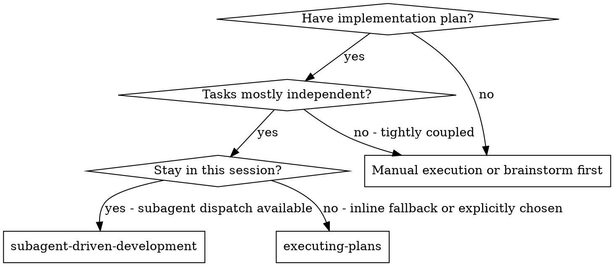
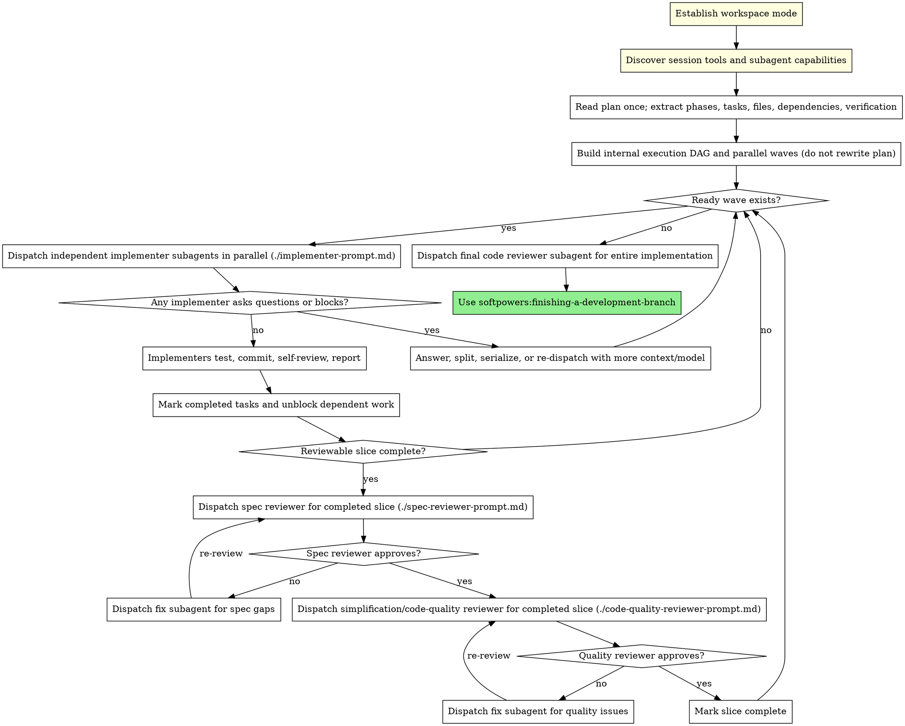

# Subagent-Driven Development

Execute phased plans by dispatching fresh subagents for sub-tasks, with two-stage review at reviewable boundaries: spec compliance review first, then simplification/code-quality review.

This is Softpowers' delegated implementation mode. Use it only when the human explicitly chooses to have agents implement the plan. For the default human-led path, use `softassist` instead.

**Why subagents:** You delegate tasks to specialized agents with isolated context. By precisely crafting their instructions and context, you ensure they stay focused and succeed at their task. They should never inherit your session's context or history. You construct exactly what they need. This also preserves your own context for coordination work.

**Core principle:** Fresh subagent per sub-task + an internal parallel execution schedule + two-stage review at reviewable boundaries (spec then simplification/quality) = high quality without review spam. Track task completion as work progresses, but dispatch external reviewers only when a reviewable slice of work is complete, not after every task/sub-task.

## When to Use



**vs. Executing Plans (inline fallback):**
- Same session (no context switch)
- Fresh subagent per sub-task (no context pollution)
- Explicit discovery of available session tools and multi-subagent capabilities before dispatch
- Internal parallelization pass: derive dependency waves from the plan without rewriting the plan
- Two-stage review after each reviewable slice: spec compliance first, then simplification/code quality
- No reviewer dispatch after individual sub-tasks unless a sub-task is explicitly its own reviewable slice
- Faster iteration with fewer reviewer invocations than per-task review

## The Process



### Workspace Setup

Before dispatching any implementer subagent:

1. Determine the repository default branch if possible. If it cannot be detected reliably, treat `main` and `master` as the default-branch candidates.
2. Determine the current branch
3. If already told which workspace mode to use, follow it
4. Otherwise ask:
   - On the default branch: `New worktree` or `New branch here`
   - On any other branch: `Continue here`, `New worktree`, or `New branch here`
5. For `New worktree`: use `softpowers:using-git-worktrees`
6. For `New branch here`:
    - Ask for the new branch name before creating it
    - Check whether the working tree is dirty
    - If dirty, warn that uncommitted changes will remain in the current directory after the branch switch and ask whether to continue
    - Create and switch to the fresh branch in the current directory only after confirmation
7. For `Continue here`: verify the current branch is not the default branch, then proceed in place
8. Once workspace selection is settled and before dispatching any implementer subagent, start the local reviewer server automatically in that workspace so the user can review while you work. Only ask instead if the user explicitly opted out or if you do not have the required session ID.

### Capability Discovery

Before reading and scheduling the plan, inspect what this session can actually do:

1. Identify available subagent/session tools and their concurrency model. Prefer explicit multi-agent tooling when it exists; otherwise fall back to one-at-a-time dispatch.
2. Identify whether the tool supports parallel children, dependency-aware workflows, background execution, result pickup, cancellation, and per-child working directories.
3. Identify available agent profiles or model choices, if the harness exposes them.
4. Note practical limits: max useful parallelism, whether agents share a working tree, whether they can commit independently, and how merge conflicts will be surfaced.
5. Use these capabilities to choose an execution organization. Do not assume Claude Code `Task` semantics in other harnesses.

If true parallel subagents are unavailable, keep the same dependency analysis but execute each ready item serially.

### Internal Parallelization Pass

After reading the plan once, rethink how to execute it. This is an internal controller schedule, not a plan rewrite.

1. Extract every phase, task, step, file path, command, acceptance criterion, and stated dependency.
2. Build a dependency graph:
   - Order tasks that depend on generated types, APIs, migrations, fixtures, or earlier behavior.
   - Treat tasks that edit the same file, adjacent files with shared exports, shared snapshots, lockfiles, migrations, generated files, or global config as conflicting unless the plan explicitly isolates them.
   - Treat verification, integration tests, commits, and reviews as barriers unless they are scoped to one isolated slice.
3. Group ready work into parallel waves. A wave may contain tasks from different original phases when they are independent.
4. Define reviewable slices. Prefer the original phase boundary when it is coherent, but if the dependency graph exposes independent slices, review each slice when all work needed for that slice is complete.
5. Keep the canonical plan unchanged. Track the internal schedule separately in your todo list or controller notes.
6. Before dispatch, give each implementer only its own task text plus the relevant slice context, dependencies, claimed files, and conflict boundaries.
7. If a task looks too broad for one agent, split it internally into smaller dispatch units only when the split preserves the plan's acceptance criteria. Do not edit the plan just to reflect the split.
8. When parallel agents finish, integrate reports deliberately before unblocking downstream waves. Run the slice verification commands before review.

## Model Selection

Use the least powerful model that can handle each role to conserve cost and increase speed.

**Mechanical sub-tasks** (isolated functions, clear specs, 1-2 files): use a fast, cheap model. Most sub-tasks are mechanical when the plan is well-specified.

**Integration and judgment tasks** (multi-file coordination, pattern matching, debugging): use a standard model.

**Architecture, design, and review tasks**: use the most capable available model.

**Sub-task complexity signals:**
- Touches 1-2 files with a complete spec → cheap model
- Touches multiple files with integration concerns → standard model
- Requires design judgment or broad codebase understanding → most capable model

## Handling Implementer Status

Implementer subagents report one of four statuses. Handle each appropriately:

**DONE:** Mark the sub-task complete. Integrate the report, update the internal dependency graph, and unblock any downstream work that is now ready. If this completed a reviewable slice, run the slice verification commands and proceed to spec compliance review.

**DONE_WITH_CONCERNS:** The implementer completed the sub-task but flagged doubts. Read the concerns before proceeding. If the concerns are about correctness or scope, address them before unblocking dependent work. If they're observations (e.g., "this file is getting large"), note them for the slice review.

**NEEDS_CONTEXT:** The implementer needs information that wasn't provided. Provide the missing context and re-dispatch.

**BLOCKED:** The implementer cannot complete the sub-task. Assess the blocker:
1. If it's a context problem, provide more context and re-dispatch with the same model
2. If the sub-task requires more reasoning, re-dispatch with a more capable model
3. If the sub-task is too large, break it into smaller pieces
4. If the plan itself is wrong, escalate to the human

**Never** ignore an escalation or force the same model to retry without changes. If the implementer said it's stuck, something needs to change.

## Parallel Dispatch Discipline

Parallelism is for independent work only.

- Dispatch all ready, non-conflicting tasks in a wave together when the harness supports it.
- Assign each parallel child a clear file/scope claim and tell it not to edit outside that scope without asking.
- Do not run two implementers against the same files or shared generated artifacts at the same time.
- Do not start downstream work until the prerequisite wave has reported, verification has run, and the dependency graph has been updated.
- If parallel results conflict, stop the wave, resolve or dispatch a focused fix agent, then re-run verification before continuing.
- Use dependency-aware workflow tooling when available; otherwise manually launch independent children and wait for their terminal results before scheduling dependent work.

## Prompt Templates

- `./implementer-prompt.md` - Dispatch implementer subagent
- `./spec-reviewer-prompt.md` - Dispatch spec compliance reviewer subagent
- `./code-quality-reviewer-prompt.md` - Dispatch simplification/code-quality reviewer subagent
- `./phase-fix-prompt.md` - Dispatch fix subagent for slice review findings

## Example Workflow

`<resolved-plan-path>` means the actual plan location after resolving `$PROJECTS_DOCS_PATH`, if configured.

```
You: I'm using Subagent-Driven Development to execute this plan.

[Discover session tools: parallel children, workflow support, agent profiles, cwd support]
[Read plan file once: <resolved-plan-path>]
[Extract all phases and sub-tasks with full text and context]
[Build internal dependency graph and parallel waves without rewriting the plan]
[Create TodoWrite with phases, slices, waves, and sub-tasks]

Slice A: Hook installation primitives

Wave A1: independent setup tasks

Sub-task 1.1: Hook installation script
Sub-task 2.1: Config directory discovery

[Get each sub-task text and slice context (already extracted)]
[Dispatch both implementation subagents in parallel with full sub-task text + context + claimed files]

Implementer: "Before I begin - should the hook be installed at user or system level?"

You: "User level (~/.config/softpowers/hooks/)"

Implementer: "Got it. Implementing now..."
[Later] Implementer:
  - Implemented install-hook command
  - Added tests, 5/5 passing
  - Self-review: Found I missed --force flag, added it
  - Committed

[Mark Sub-task 1.1 complete]
[Mark Sub-task 2.1 complete]
[Update dependency graph]

Wave A2: recovery modes (depends on A1)

Sub-task 1.2: Recovery modes

[Get Sub-task 1.2 text and slice context (already extracted)]
[Dispatch implementation subagent with full sub-task text + context]

Implementer: [No questions, proceeds]
Implementer:
  - Added verify/repair modes
  - 8/8 tests passing
  - Self-review: All good
  - Committed

[Mark Sub-task 1.2 complete]

[Slice A complete: run verification, then dispatch spec compliance reviewer for all Slice A changes]
Spec reviewer: ❌ Issues:
  - Missing: Progress reporting (spec says "report every 100 items")
  - Extra: Added --json flag (not requested)

[Dispatch fix subagent with ./phase-fix-prompt.md, Slice A requirements + spec review findings]
Fix subagent: Removed --json flag, added progress reporting

[Spec reviewer reviews Slice A again]
Spec reviewer: ✅ Slice spec compliant now

[Get git SHAs for full slice, dispatch simplification/code-quality reviewer]
Code reviewer: Strengths: Solid. Issues (Important): Magic number (100)

[Dispatch fix subagent with ./phase-fix-prompt.md, Slice A requirements + quality review findings]
Fix subagent: Extracted PROGRESS_INTERVAL constant

[Code reviewer reviews Slice A again]
Code reviewer: ✅ Approved

[Mark Slice A complete]

Slice B: [next reviewable outcome]
...

[After all phases]
[Dispatch final code-reviewer]
Final reviewer: All requirements met, ready to merge

Done!
```

## Advantages

**vs. Manual execution:**
- Subagents follow TDD naturally
- Fresh context per sub-task (no confusion)
- Parallel-safe (subagents don't interfere)
- Subagent can ask questions (before AND during work)

**vs. Executing Plans:**
- Same session (no handoff)
- Continuous progress (no waiting)
- Review checkpoints automatic

**Efficiency gains:**
- No file reading overhead (controller provides full text)
- Controller curates exactly what context is needed
- Subagent gets complete information upfront
- Questions surfaced before work begins (not after)

**Quality gates:**
- Self-review catches issues before handoff
- Two-stage review: spec compliance, then simplification/code quality
- Review loops ensure fixes actually work
- Spec compliance prevents over/under-building
- Code quality ensures implementation is well-built

**Cost:**
- More implementer invocations (one per sub-task)
- Fewer reviewer invocations than per-task review (2 reviewers per reviewable slice, plus final review)
- Controller does more prep work (extracting phases and sub-tasks upfront)
- Review loops add iterations, but only at phase boundaries
- Still catches issues before they cascade across phases

## Red Flags

**Never:**
- Start implementation on main/master branch without explicit user consent
- Skip reviews (spec compliance OR simplification/code quality)
- Proceed with unfixed issues
- Dispatch implementation subagents before discovering session tool/subagent capabilities
- Dispatch multiple implementation subagents in parallel without an internal dependency/conflict analysis
- Dispatch multiple implementation subagents in parallel against the same files, generated artifacts, migrations, lockfiles, or global config
- Rewrite the canonical plan just to match your internal parallel schedule
- Make subagent read plan file (provide full text instead)
- Skip scene-setting context (subagent needs to understand where task fits)
- Ignore subagent questions (answer before letting them proceed)
- Accept "close enough" on spec compliance (spec reviewer found issues = not done)
- Skip review loops (reviewer found issues = phase fix subagent fixes = review again)
- Let implementer self-review replace actual review (both are needed)
- **Start simplification/code-quality review before spec compliance is ✅** (wrong order)
- Unblock dependent waves while either slice review has open issues
- Dispatch spec or simplification/code-quality reviewers after every task/sub-task unless the task is its own reviewable slice

**If subagent asks questions:**
- Answer clearly and completely
- Provide additional context if needed
- Don't rush them into implementation

**If reviewer finds slice issues:**
- Dispatch a fix subagent with `./phase-fix-prompt.md`, the slice requirements, relevant sub-task context, and reviewer findings
- Reviewer reviews the full slice again
- Repeat until approved
- Don't skip the re-review

**If subagent fails a sub-task:**
- Dispatch fix subagent with specific instructions
- Don't try to fix manually (context pollution)

## Integration

**Required workflow skills:**
- **softpowers:using-git-worktrees** - REQUIRED only when the chosen workspace mode is `New worktree`
- **softpowers:writing-plans** - Creates the plan this skill executes
- **softpowers:requesting-code-review** - Code review template for reviewer subagents
- **softpowers:finishing-a-development-branch** - Complete development after all reviewable slices

**Subagents should use:**
- **softpowers:test-driven-development** - Subagents follow TDD for each implementation sub-task

**Fallback workflow:**
- **softpowers:executing-plans** - Use when subagent dispatch is unavailable or the human explicitly chooses inline execution
