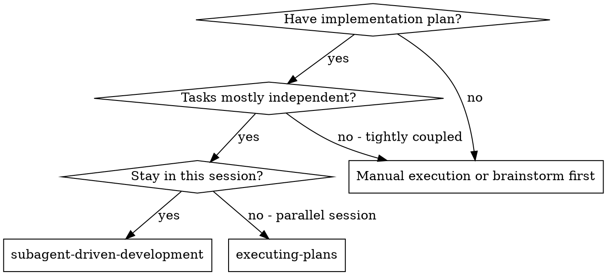
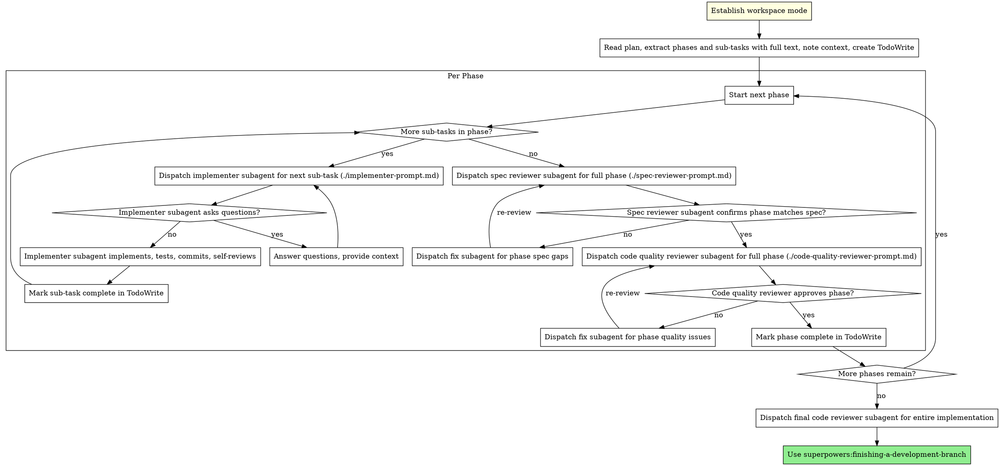

# Subagent-Driven Development

Execute phased plans by dispatching fresh subagents for sub-tasks, with two-stage review at the end of each phase: spec compliance review first, then code quality review.

**Why subagents:** You delegate tasks to specialized agents with isolated context. By precisely crafting their instructions and context, you ensure they stay focused and succeed at their task. They should never inherit your session's context or history — you construct exactly what they need. This also preserves your own context for coordination work.

**Core principle:** Fresh subagent per sub-task + two-stage review at phase boundaries (spec then quality) = high quality without review spam. Track task completion as work progresses, but dispatch external reviewers only at the end of the phase, not after every task/sub-task.

## When to Use



**vs. Executing Plans (parallel session):**
- Same session (no context switch)
- Fresh subagent per sub-task (no context pollution)
- Two-stage review after each phase: spec compliance first, then code quality
- No reviewer dispatch after individual sub-tasks unless a sub-task is explicitly its own phase
- Faster iteration with fewer reviewer invocations than per-task review

## The Process



### Workspace Setup

Before dispatching any implementer subagent:

1. Determine the repository default branch if possible. If it cannot be detected reliably, treat `main` and `master` as the default-branch candidates.
2. Determine the current branch
3. If already told which workspace mode to use, follow it
4. Otherwise ask:
   - On the default branch: `New worktree` or `New branch here`
   - On any other branch: `Continue here`, `New worktree`, or `New branch here`
5. For `New worktree`: use `superpowers:using-git-worktrees`
6. For `New branch here`:
    - Ask for the new branch name before creating it
    - Check whether the working tree is dirty
    - If dirty, warn that uncommitted changes will remain in the current directory after the branch switch and ask whether to continue
    - Create and switch to the fresh branch in the current directory only after confirmation
7. For `Continue here`: verify the current branch is not the default branch, then proceed in place
8. Once workspace selection is settled and before dispatching any implementer subagent, start the local reviewer server automatically in that workspace so the user can review while you work. Only ask instead if the user explicitly opted out or if you do not have the required session ID.

## Model Selection

Use the least powerful model that can handle each role to conserve cost and increase speed.

**Mechanical sub-tasks** (isolated functions, clear specs, 1-2 files): use a fast, cheap model. Most sub-tasks are mechanical when the plan is well-specified.

**Integration and judgment tasks** (multi-file coordination, pattern matching, debugging): use a standard model.

**Architecture, design, and review tasks**: use the most capable available model.

**Sub-task complexity signals:**
- Touches 1-2 files with a complete spec → cheap model
- Touches multiple files with integration concerns → standard model
- Requires design judgment or broad codebase understanding → most capable model

## Handling Implementer Status

Implementer subagents report one of four statuses. Handle each appropriately:

**DONE:** Mark the sub-task complete. If more sub-tasks remain in the current phase, continue with the next sub-task. If this was the final sub-task in the phase, proceed to phase spec compliance review.

**DONE_WITH_CONCERNS:** The implementer completed the sub-task but flagged doubts. Read the concerns before proceeding. If the concerns are about correctness or scope, address them before continuing the phase. If they're observations (e.g., "this file is getting large"), note them for the phase review.

**NEEDS_CONTEXT:** The implementer needs information that wasn't provided. Provide the missing context and re-dispatch.

**BLOCKED:** The implementer cannot complete the sub-task. Assess the blocker:
1. If it's a context problem, provide more context and re-dispatch with the same model
2. If the sub-task requires more reasoning, re-dispatch with a more capable model
3. If the sub-task is too large, break it into smaller pieces
4. If the plan itself is wrong, escalate to the human

**Never** ignore an escalation or force the same model to retry without changes. If the implementer said it's stuck, something needs to change.

## Prompt Templates

- `./implementer-prompt.md` - Dispatch implementer subagent
- `./spec-reviewer-prompt.md` - Dispatch spec compliance reviewer subagent
- `./code-quality-reviewer-prompt.md` - Dispatch code quality reviewer subagent
- `./phase-fix-prompt.md` - Dispatch fix subagent for phase review findings

## Example Workflow

`<resolved-plan-path>` means the actual plan location after resolving `$OBSIDIAN_PROJECTS_PATH`, if configured.

```
You: I'm using Subagent-Driven Development to execute this plan.

[Read plan file once: <resolved-plan-path>]
[Extract all phases and sub-tasks with full text and context]
[Create TodoWrite with phases and sub-tasks]

Phase 1: Hook installation

Sub-task 1.1: Hook installation script

[Get Sub-task 1.1 text and phase context (already extracted)]
[Dispatch implementation subagent with full sub-task text + context]

Implementer: "Before I begin - should the hook be installed at user or system level?"

You: "User level (~/.config/superpowers/hooks/)"

Implementer: "Got it. Implementing now..."
[Later] Implementer:
  - Implemented install-hook command
  - Added tests, 5/5 passing
  - Self-review: Found I missed --force flag, added it
  - Committed

[Mark Sub-task 1.1 complete]

Sub-task 1.2: Recovery modes

[Get Sub-task 1.2 text and phase context (already extracted)]
[Dispatch implementation subagent with full sub-task text + context]

Implementer: [No questions, proceeds]
Implementer:
  - Added verify/repair modes
  - 8/8 tests passing
  - Self-review: All good
  - Committed

[Mark Sub-task 1.2 complete]

[End of Phase 1: dispatch spec compliance reviewer for all Phase 1 changes]
Spec reviewer: ❌ Issues:
  - Missing: Progress reporting (spec says "report every 100 items")
  - Extra: Added --json flag (not requested)

[Dispatch fix subagent with ./phase-fix-prompt.md, Phase 1 requirements + spec review findings]
Fix subagent: Removed --json flag, added progress reporting

[Spec reviewer reviews Phase 1 again]
Spec reviewer: ✅ Phase spec compliant now

[Get git SHAs for full phase, dispatch code quality reviewer]
Code reviewer: Strengths: Solid. Issues (Important): Magic number (100)

[Dispatch fix subagent with ./phase-fix-prompt.md, Phase 1 requirements + quality review findings]
Fix subagent: Extracted PROGRESS_INTERVAL constant

[Code reviewer reviews Phase 1 again]
Code reviewer: ✅ Approved

[Mark Phase 1 complete]

Phase 2: [next reviewable outcome]
...

[After all phases]
[Dispatch final code-reviewer]
Final reviewer: All requirements met, ready to merge

Done!
```

## Advantages

**vs. Manual execution:**
- Subagents follow TDD naturally
- Fresh context per sub-task (no confusion)
- Parallel-safe (subagents don't interfere)
- Subagent can ask questions (before AND during work)

**vs. Executing Plans:**
- Same session (no handoff)
- Continuous progress (no waiting)
- Review checkpoints automatic

**Efficiency gains:**
- No file reading overhead (controller provides full text)
- Controller curates exactly what context is needed
- Subagent gets complete information upfront
- Questions surfaced before work begins (not after)

**Quality gates:**
- Self-review catches issues before handoff
- Two-stage review: spec compliance, then code quality
- Review loops ensure fixes actually work
- Spec compliance prevents over/under-building
- Code quality ensures implementation is well-built

**Cost:**
- More implementer invocations (one per sub-task)
- Fewer reviewer invocations than per-task review (2 reviewers per phase, plus final review)
- Controller does more prep work (extracting phases and sub-tasks upfront)
- Review loops add iterations, but only at phase boundaries
- Still catches issues before they cascade across phases

## Red Flags

**Never:**
- Start implementation on main/master branch without explicit user consent
- Skip reviews (spec compliance OR code quality)
- Proceed with unfixed issues
- Dispatch multiple implementation subagents in parallel (conflicts)
- Make subagent read plan file (provide full text instead)
- Skip scene-setting context (subagent needs to understand where task fits)
- Ignore subagent questions (answer before letting them proceed)
- Accept "close enough" on spec compliance (spec reviewer found issues = not done)
- Skip review loops (reviewer found issues = phase fix subagent fixes = review again)
- Let implementer self-review replace actual review (both are needed)
- **Start code quality review before spec compliance is ✅** (wrong order)
- Move to the next phase while either phase review has open issues
- Dispatch spec or code quality reviewers after every task/sub-task unless the plan explicitly defines that task as its own phase

**If subagent asks questions:**
- Answer clearly and completely
- Provide additional context if needed
- Don't rush them into implementation

**If reviewer finds phase issues:**
- Dispatch a fix subagent with `./phase-fix-prompt.md`, the phase requirements, relevant sub-task context, and reviewer findings
- Reviewer reviews the full phase again
- Repeat until approved
- Don't skip the re-review

**If subagent fails a sub-task:**
- Dispatch fix subagent with specific instructions
- Don't try to fix manually (context pollution)

## Integration

**Required workflow skills:**
- **superpowers:using-git-worktrees** - REQUIRED only when the chosen workspace mode is `New worktree`
- **superpowers:writing-plans** - Creates the plan this skill executes
- **superpowers:requesting-code-review** - Code review template for reviewer subagents
- **superpowers:finishing-a-development-branch** - Complete development after all phases

**Subagents should use:**
- **superpowers:test-driven-development** - Subagents follow TDD for each implementation sub-task

**Alternative workflow:**
- **superpowers:executing-plans** - Use for parallel session instead of same-session execution
