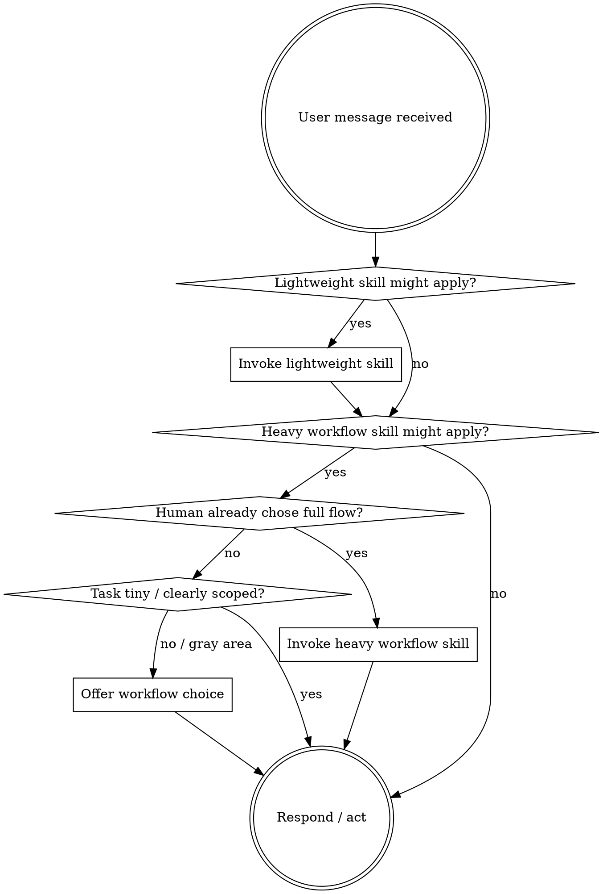

<SUBAGENT-STOP>
If you were dispatched as a subagent to execute a specific task, skip this skill.
</SUBAGENT-STOP>

<EXTREMELY-IMPORTANT>
You have Superpowers available, but you do NOT need to force the full Superpowers workflow onto every task.

Separate skills into two groups:

1. **Lightweight skills** — domain-specific, tool-specific, reference, or narrowly scoped skills
2. **Heavy workflow skills** — process skills that add substantial ceremony (brainstorming, writing-plans, test-driven-development, systematic-debugging, worktree/branch orchestration, branch-finishing flows)

Use lightweight skills whenever they help.

Use heavy workflow skills when:
- the human explicitly asks for them
- the task clearly warrants them
- or the human chooses the structured Superpowers flow after you offer the option
</EXTREMELY-IMPORTANT>

## Instruction Priority

Superpowers skills override default system prompt behavior, but **user instructions always take precedence**:

1. **User's explicit instructions** (CLAUDE.md, GEMINI.md, AGENTS.md, direct requests) — highest priority
2. **Superpowers skills** — override default system behavior where they conflict
3. **Default system prompt** — lowest priority

If CLAUDE.md, GEMINI.md, or AGENTS.md says "don't use TDD" and a skill says "always use TDD," follow the user's instructions. The user is in control.

## Workflow Selection

Before invoking a heavy workflow skill, place the task in one of three modes:

- **Direct execution** — trivial questions, small targeted edits, obvious one-step work, or clear "just do it" requests. Proceed normally. Ask clarifying questions if needed.
- **Light guidance** — a couple questions, trade-offs, or a short in-chat plan would help, but formal spec/plan documents would be overkill. Stay conversational.
- **Full Superpowers flow** — new features, behavior changes with open design questions, risky refactors, multi-step work, or anytime the human asks to brainstorm, plan, or be especially systematic.

If the task sits in the gray area, ask a short workflow-choice question before invoking a heavy workflow skill. Use the human partner's language.

Example:
> "I can handle this directly, keep it lightweight with a short plan in chat, or switch into the full Superpowers flow (brainstorm → spec → plan → execution). Which do you want?"

Remember the chosen mode for the current task. Do not re-ask on every turn unless the scope changes materially or the human changes direction.

The mode is not permanent. If the human later says they want more structure, switch into the full flow at that point.

**Explicit skill requests bypass the mode question.** If the human explicitly asks for brainstorming, writing-plans, systematic-debugging, or another named skill, use it.

## How to Access Skills

**In Claude Code:** Use the `Skill` tool. When you invoke a skill, its content is loaded and presented to you—follow it directly. Never use the Read tool on skill files.

**In Copilot CLI:** Use the `skill` tool. Skills are auto-discovered from installed plugins. The `skill` tool works the same as Claude Code's `Skill` tool.

**In Gemini CLI:** Skills activate via the `activate_skill` tool. Gemini loads skill metadata at session start and activates the full content on demand.

**In other environments:** Check your platform's documentation for how skills are loaded.

## Platform Adaptation

Skills use Claude Code tool names. Non-CC platforms: see `references/copilot-tools.md` (Copilot CLI), `references/codex-tools.md` (Codex) for tool equivalents. Gemini CLI users get the tool mapping loaded automatically via GEMINI.md.

# Using Skills

## The Rule

Invoke relevant or requested skills before acting, but do not confuse "relevant" with "maximum ceremony."

1. **Check for lightweight skills first** — domain, tool, and reference skills still apply normally
2. **Use heavy workflow skills immediately when explicitly requested**
3. **If a heavy workflow skill might apply but the task is clearly tiny or direct, stay in direct execution**
4. **If a heavy workflow skill might apply and the task is non-trivial but ambiguous, ask the workflow-choice question first**
5. **Once a mode is chosen, follow it consistently until the human changes it**

## Red Flags

These thoughts mean STOP—you may be adding unnecessary ceremony or ignoring the human's preferred mode:

| Thought | Reality |
|---------|---------|
| "I should force the full workflow just in case" | Only do that if the human asked for it or the task clearly warrants it. |
| "This is simple, but I still need a mode-selection ceremony" | Tiny, direct tasks can stay direct. |
| "The human said 'just do it', but I should start brainstorming first" | Direct instructions about workflow win. |
| "No heavy workflow skill means no skills at all" | Lightweight/domain skills still apply. |
| "We started direct, so we must stay direct forever" | You can switch modes later if the human asks. |

## Skill Priority

When multiple skills could apply, use this order:

1. **In full Superpowers flow: process skills first** (brainstorming, debugging) — these determine HOW to approach the task
2. **Then implementation skills** (frontend-design, mcp-builder) — these guide execution
3. **Outside full-flow mode:** use the narrowest relevant skill without adding unnecessary ceremony

"Let's build X" can mean either direct execution or full flow — decide based on the chosen mode.
"Fix this bug" can mean direct debugging or systematic-debugging — decide based on the chosen mode.

## Skill Types

**Rigid** (TDD, debugging): Follow exactly once you choose to use them. Don't adapt away discipline.

**Flexible** (patterns): Adapt principles to context.

The skill itself tells you which.

## User Instructions

Instructions say WHAT, not HOW. "Add X" or "Fix Y" does not always mean "run the full Superpowers ceremony first." Respect the human's requested workflow and level of structure.
